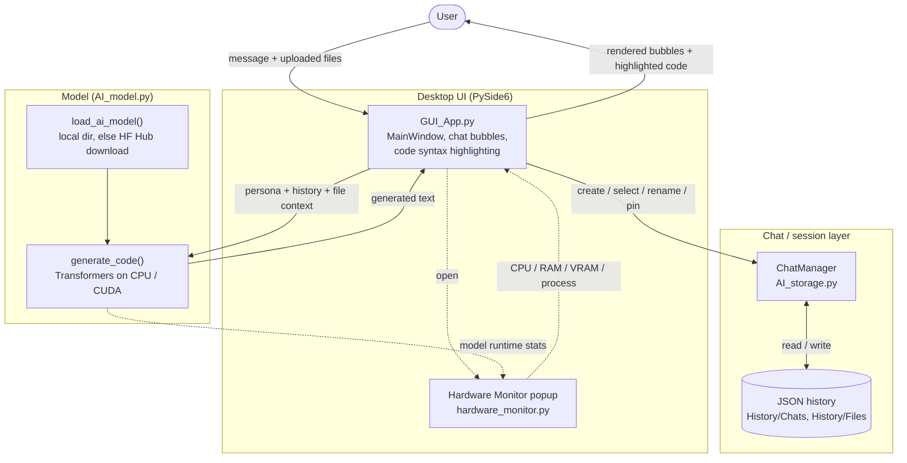

# ZEDX AI

ZEDX AI is a local-first desktop AI assistant built with **PySide6** and **Transformers**
(the running app window is titled **NeuralIDE**).
It provides a multi-chat coding interface with file-aware context, syntax-highlighted code blocks, and live hardware/model monitoring.
Default configured base model: **Qwen/Qwen2.5-Coder-1.5B-Instruct**.
Model page: https://huggingface.co/Qwen/Qwen2.5-Coder-1.5B-Instruct

## Architecture



<!--
Screenshot slot -- a screenshot of the running app really helps here.
Drop an image at docs/screenshots/main.png and uncomment the line below:

-->

## Features

- Local LLM chat UI (no required cloud dependency for inference)
- Multi-chat history with:
  - rename (inline)
  - pin/unpin
  - per-chat clear
  - delete
- Per-chat persona prompt
- File upload per chat
- Image file copy support from file list
- Search across chat titles and message contents
- Syntax-highlighted code blocks with copy button
- Startup model warmup (loads model before first message)
- Live monitor popup for:
  - CPU usage
  - RAM usage
  - Storage usage
  - VRAM usage
  - Process usage
  - Current AI model runtime stats
- GitHub Dark Colorblind-inspired UI theme

## Project Structure

```text
ZEDX-AI/
  GUI_App.py                 # Main desktop app (entry point)
  AI_model.py                # Model loading + generation
  AI_storage.py              # Chat/file persistence
  AI_Settings.py             # Settings loader
  AI_config.py               # Config helpers
  hardware_monitor.py        # Hardware/model monitoring helpers
  requirements.txt           # Python dependencies
  Config/
    AI_Config.json           # AI/runtime settings
    GUI_Config.json          # UI behavior settings
    Theme_QSS.json           # Theme styles
  docs/
    screenshots/             # Screenshots used in the README
  History/                   # Created at runtime (git-ignored)
    Chats/                   # Chat JSON files
    Files/                   # Uploaded chat files
  Model/                     # Optional local model files (git-ignored)
    qwen_local_model/        # Local model/tokenizer files
```

If `LOCAL_DIR` does not exist, the app automatically downloads and loads
`MODEL_ID` from the Hugging Face Hub instead.

## Requirements

- Python 3.10+
- Linux/Windows (Linux tested)
- Python packages:
  - `PySide6`
  - `torch`
  - `transformers`
  - `accelerate` (needed for GPU `device_map="auto"`; harmless on CPU-only setups)
  - `psutil` (recommended for full monitor stats)

Install (from the project root):

```bash
pip install -r requirements.txt
```

## Run

From the project root:

```bash
python3 GUI_App.py
```

## Configuration

Main config files:

- `Config/AI_Config.json`
- `Config/GUI_Config.json`
- `Config/Theme_QSS.json`

Important AI settings in `AI_Config.json`:

- `MODEL_ID`
- `LOCAL_DIR`
- `MAX_TOKENS` — maximum tokens generated per reply. The configured value is
  honored, guarded only by an internal safety ceiling (`MAX_NEW_TOKENS_CEILING`,
  8192) to prevent runaway generation from a bad config value.
- `TEMPERATURE`
- `MAX_HISTORY_MESSAGES`
- `MAX_FILE_CHARS`
- `TRUST_REMOTE_CODE` — defaults to `false`. See the security note below.

By default, the app uses:

```json
"MODEL_ID": "Qwen/Qwen2.5-Coder-1.5B-Instruct",
"LOCAL_DIR": "./Model/qwen_local_model"
```

Local model files are optional: if `LOCAL_DIR` does not exist, the app falls back to
`MODEL_ID` and downloads it from the Hugging Face Hub on first run. To force offline
use, place the model files in that folder (or update this path).

### Security note: `TRUST_REMOTE_CODE`

Models are loaded with `trust_remote_code` set to the value of `TRUST_REMOTE_CODE`
in `AI_Config.json`, which **defaults to `false`**. When enabled, any custom
modeling code shipped by the model repo runs as arbitrary Python at load time.
Because `MODEL_ID` can point at any Hugging Face repo (and is downloaded on first
run), leave this `false` unless you fully trust the repo. The default model,
`Qwen/Qwen2.5-Coder-1.5B-Instruct`, does not require remote code.

## Model Download (Optional)

The model is loaded automatically from the Hugging Face Hub on first run using
`MODEL_ID`. If you prefer a local copy (for offline use), download it into the
`LOCAL_DIR` path configured in `AI_Config.json`:

```text
Model/qwen_local_model
```

Hugging Face model link:

- https://huggingface.co/Qwen/Qwen2.5-Coder-1.5B-Instruct

Example using `huggingface_hub` CLI:

```bash
pip install -U huggingface_hub
huggingface-cli download Qwen/Qwen2.5-Coder-1.5B-Instruct \
  --local-dir "Model/qwen_local_model"
```

## How File Context Works

- Upload files from the `Upload` button.
- Files are attached to the selected chat.
- The selected file in the sidebar is prioritized when you ask things like "check this file".
- Text file content is injected into the model prompt up to `MAX_FILE_CHARS`.

## Hardware Monitor

Click the `Monitor` button in the top bar to open a live dashboard popup.
It refreshes periodically and shows system + model runtime usage.

## Troubleshooting

- `ModuleNotFoundError: No module named PySide6`
  - Install dependencies with `pip install PySide6`.

- Model does not load:
  - Verify `LOCAL_DIR` path in `AI_Config.json`.
  - Ensure tokenizer/model files are present.

- Monitor shows reduced stats:
  - Install `psutil` for more complete CPU/RAM/process metrics.

## Notes

- Chat history and uploaded files are stored locally under `History/` (git-ignored).
- This project is designed for local-first development workflows.
